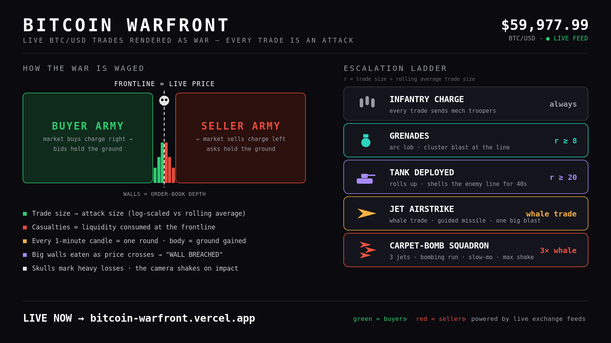

# ⚔️ Bitcoin Warfront

**Live BTC/USD market data rendered as a real-time war between buyers and sellers.**

🔴 **Live:** [bitcoin-warfront.vercel.app](https://bitcoin-warfront.vercel.app)

Every trade is an attack. The battlefield *is* the chart: the ground is the
price axis, the frontline is the live price, order-book walls are literal
fortifications, and whales call in airstrikes. Nothing on the field is
invented — everything that explodes traces back to real traded volume.



---

## How the war is waged

| Battlefield | Market reality |
|---|---|
| The ground | The price axis — bright numerals mark every $50, ticks every $10 |
| Frontline (white wall) | Live price. Glides (tweens) to each new price, **sweeping stragglers along** — no living unit ends up on the wrong side |
| Green army (bulls) | The bid side — market buys charge from the left |
| Red army (bears) | The ask side — market sells charge from the right |
| Troop clusters | **The army is the depth histogram**: soldiers mass at price levels with real resting liquidity |
| Translucent walls | Order-book depth, standing at their true prices, width matched to bucket size |
| Charges & casualties | Trades from the live tape, log-scaled vs the rolling average; every falling soldier is a counted kill delivered by a visible tracer |
| Battle rounds | 1-minute candles — body = ground gained/lost, banner every close |
| "WALL BREACHED" | A large depth wall eaten as price crossed it |
| Holo chart | Real BTC candles (1D/1W/1M/1Y) floating above the frontline rod — time along the rod, price vertical, live tick at the end. Mirrors so time reads left→right from either side |
| HIGH / LOW flags | Session extremes standing at their true prices on the ruler |
| Spread lines | Best bid and ask hugging the rod — the gap between armies IS the spread |
| Volume profile ridge | Traded volume builds terrain along the back edge per $10 bucket; the point of control (POC) glows orange |
| Depth ghosts | A big wall that vanishes with price far away was **pulled, not eaten** — a wireframe ghost fades where it stood. Spoofing, made visible |
| ⚡ Execution beams | **Real forced liquidations** — a liquidated long means bull soldiers behind their own lines get a cold beam of light and dissolve. Scaled by notional ($100k+ gets a banner, $1M+ slow-mo); 3 in 5s = "LIQUIDATION CASCADE" |

## Escalation ladder

Trade size relative to the rolling average (`r`) decides the weapon class.
Near-boundary trades roll **escalation dice** (≤35% to jump a tier), so the
long-run hardware frequency still tracks real flow.

| Tier | Trigger | Effect | Key |
|---|---|---|---|
| Infantry | every trade | mech troopers charge | — |
| Grenades | r ≥ 5 | arc lob, cluster blast | `1` |
| Tank | r ≥ 12 | rolls up, shells the line ~40s, **plows infantry aside** | `2` |
| Helicopter | r ≥ 25 | hovers over the front, rocket volleys | `3` |
| Jet airstrike | whale (~4+ BTC adaptive) | guided missile, one big blast | `4` |
| Carpet squadron | 2.5× whale | 3 jets, bombing run, slow-mo | `5` |
| MOAB | 6× whale | bomber + **bomb cam**, screen flash, mushroom cloud, max shake | `6` |

**Artillery budget** (background): each side's cumulative volume fills an
ordnance pot (meters under the kill counters). When it tips (~18× avg),
it's spent on rotating mortar barrages / tank sorties / strafing runs — small
trades pool into big booms. A **director** guarantees no 45 seconds pass
without heavy hardware, spending whatever the pot holds (7% MOAB jackpot).

Demo hotkeys `1–6` fire each tier directly for show-and-tell, and `8`
triggers a random-sized demo liquidation — all bypass the trade pipeline
and never touch the kill counters' honesty.

## Physics

- Blast victims launch ballistically from the real impact point — bigger
  bomb, farther flight (grenade = a hop, MOAB = 30+ unit arcs), tumbling,
  landing, sliding, fading
- Shockwaves stagger nearby survivors on both sides
- Tanks emit a continuous displacement field — crowds part around them
- Corpses stay where they fell; a fast advance rolls over the dead
- Zero per-frame allocations; the whole war renders in a handful of draw
  calls (InstancedMesh armies, pooled FX)

## Data feeds

Auto mode tries **Binance → Bitstamp → Coinbase → simulator**, with real
resilience: a dropped live feed retries from the top of the chain, Bitstamp
reconnect requests are honored, and the simulator (orange dot) is never a
destination — the live chain is re-probed every 60s. Pick a source from the
top-left dropdown, or force one with `?feed=binance|bitstamp|coinbase|fake`.

Trades, top-of-book depth, and candles are all derived from public WebSocket
streams. A separate liquidation feed (Binance futures → Bybit → OKX forced
orders, same fallback pattern) drives the execution beams — on live data you
see real wrecks or nothing; synthetic liquidations exist only in simulator
mode. No API keys, no backend — the entire app is static files.

## Options (top-right)

- **SOUND** — WebAudio-synthesized gunfire/explosions/jets/rotors (no audio
  files), positional: panned and attenuated by where events happen relative
  to your camera. Off by default.
- **CLEAN MODE** — hides ladder/tape/hint for streaming, OBS overlays, clips.
- **DAY/NIGHT** — battlefield lighting follows the real clock (deep night in
  the Asia overnight, brightest during the US session).
- **AUTO ORBIT** — the camera orbits on load and stops when you grab it;
  turn this on and it resumes after 30s idle.
- **CHART / HOLO** — toggle the 2D candle panel, and switch the shared
  timeframe (1D/1W/1M/1Y) for both the panel and the in-world holo chart.
- **WAR REPORT** — a shareable 16:9 stat card (kills, volume, liquidations,
  biggest whale, bloodiest round, POC, session sparkline) with PNG download.

Also: a bottom-left candle chart panel (public REST candles, auto-slides away
after 30s like the tape; the ladder folds at 10s), live trade tape,
"WHILE YOU WERE GONE" recap banner when you return to a backgrounded tab,
a live tab title showing who's winning and the price (`Bulls 63.8k`), and
ground numerals that flip to stay readable as you orbit.

## Run locally

```bash
npm install
npm run dev        # open the printed localhost URL
npm run build      # production build (Vercel auto-detects Vite)
npm run test:sim   # headless sim smoke test
```

Full test suite (all headless, no browser):

```bash
node test/sim-smoke.js      # feed → sim integration
node test/arsenal-test.js   # tier mapping + escalation dice (seeded rng)
node test/artillery-test.js # ordnance pot mechanics
node test/rebase-test.js    # price mapping, tween, seamless rebase
node test/physics-test.js   # launches, landings, stagger, displacement
node test/cluster-test.js   # troops mass at dominant walls
node test/sweep-test.js     # nobody ends up behind the moving wall
node test/liq-test.js       # executions: right side, right place, honest counters
```

## Architecture

```
src/
  market/    feed.js (auto-fallback + reconnect), adapters/ (binance,
             bitstamp, coinbase, fake), liquidations.js, klines.js,
             candles.js, normalize.js
  core/      bus.js — event bus between sim and FX
  sim/       battle.js (pure JS war sim — unit-testable, no three.js),
             arsenal.js (escalation ladder), artillery.js (ordnance pot)
  render/    scene.js, armies.js (instanced mechs), walls.js, ruler.js,
             holochart.js, markers.js, profile.js, camera.js (trauma +
             bomb cam), postfx.js (bloom + auto quality), effects.js,
             fx/ (tracers, explosions, grenades, beams), units/ (tank,
             jet, heli)
  audio/     sound.js — synthesized, positional
  ui/        hud.js, chart.js
test/        seven headless test suites
```

Data flows one way: `feed → normalize/candles → arsenal → battle sim →
renderer`. The sim never imports three.js; the renderer never touches
WebSockets. World x *is* price (`0.55 units per $`); when the front drifts
past ~$150 the entire world, camera, and FX shift by one exact offset in a
single frame and the ground ruler renumbers — an infinite battlefield with
honest prices.

## Design principle

**The market decides everything; weapons only dramatize it.** Kill counts,
charges, walls, rounds, and hardware all derive from real trades and real
liquidity. The one theatrical liberty — the quiet-period director — spends
only volume that actually traded, just on a randomized schedule.

## Roadmap

- [x] Liquidation feed — forced liquidations as battlefield executions
- [x] War report card — shareable session stats with PNG export
- [ ] Historic battle replays (COVID crash, ETF day)
- [ ] Multi-asset theaters (ETH front)
- [ ] Model-pack skin swap for units

---

Built with [Three.js](https://threejs.org) + [Vite](https://vitejs.dev).
No backend, no keys, no tracking — just public market data and a war.
